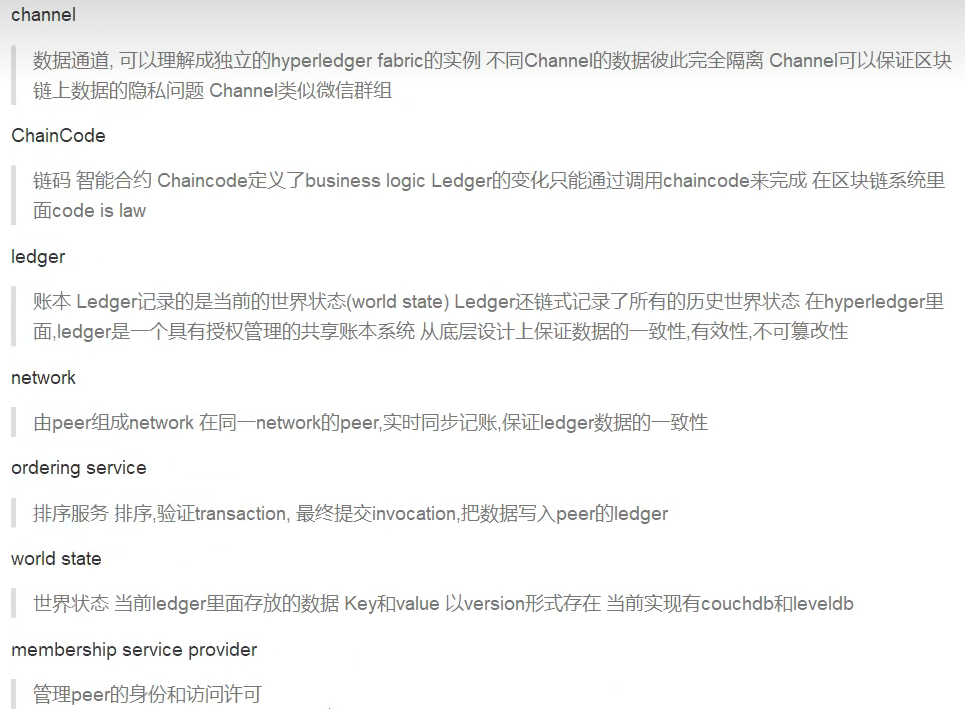
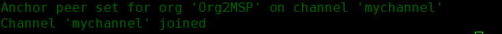
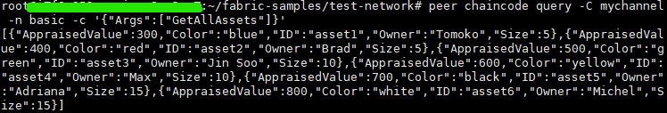

### 名词回顾

##### Hyperledger Fabric

第一个孵化出来的商用DLT框架

##### DLT

distribute ledger technology，分布式存储的是账本：book of records，DLT问题：隐私/机密/标准化，传统区块链无法解决

##### Hyperledger composer

DLT上创建商业应用的工具

##### 关键组件

peer节点、ordering service排序服务、ca证书中心、msp会员管理提供者；

使用nodejs编写链码（智能合约）

资产assert代表的是价值，资产变更会生成转账transaction（或者叫做事务）

### 重建信任

hyperledger是区块链技术，但不是数字货币，没有挖矿的概念。但其可以创造数字货币

### 数据完整性和安全性


账本由密码学签名保证

permissioned network： 授权网络 access control

confidential transaction 交易安全 transaction是可以控制可见性的

> 可以创建私有channel


no cryptocurrency 无数字货币：不用分析51%攻击？

> 没有矿工，低成本，验证操作灵活
>
> ​	programmable 可编程
>
> ​	chaincode 智能合约 链码（在hyperledger特有名词）

可以创建公有链，私有链，联盟链

每个共识协议的参与者都是由CA来认证

### Assert，chaincode&ledger

assert：有价值的东西，可以被交易的东西

> json表示；
>
> 二进制表示

chaincode

> transaction | business logic业务逻辑

ledger

> 记录所有的transaction

所有参与者都保存了ledger

hyperledger相当于存有“两套账本”：交易信息和世界状态

code is law

背书策略：提供一种规则，例如：几个参与者同意后可以出发智能合约

java开销太大，go编写比较麻烦，官方推荐nodejs

### 授权网络和MSP和CA

业务参与要求整个网络的参与者是认识的，实名制的（认证）

MSP：Membership Service Provider：Roles & Access Restrictions

#### 授权网络：修改网络必须由数字签名（x.509标准）

**<u>fabirc ca</u>**是一个高质量的工具，帮助我们生成证书，ca可以为不同用户生成不同的证书，fabric ca支持链式继承，参与者无法抵赖。

MSP是一个接口/规范，可拔插，支持各种认证体系结构，为membership orchestration architecture提供抽象层：提供具体的身份格式、用户证书验证、用户证书撤销、签名生成和验证，Fabric-CA用于生成证书和密钥，以真正的初始化MSP。

fabric-ca是用于身份管理的MSP接口的默认实现。

MSP定义你是谁，你在哪个网络，msp的证书由f-ca来颁发，每个peer都需要msp的证书。MSPID是一个名字定义一组证书，例如某个机构的某一个成员都需要一个mspid，使用hyperledger fabric sdk的时候经常就需要指定mspid。

### Node：peer、client&orderer

node是区块链的通讯终端，以太坊中node都是相同的，在hyperledger中node分为三种：

- client：实例化transaction的（cli 命令行，node sdk：nodejs，java sdk）
- peer：用来存储和同步ledger的数据
- orderer：用来排序分发transaction，类似于矿工


排序很重要，解决双花问题（并发），创建区块，对区块签名和验证。

### Channel

每个channel可以理解为独立的HF的实例，所有channel是完全独立的，或者理解为一个子网？

不同channel之间不会交换数据（群聊）

一个channel不依赖其他channel

peer默认什么事情都不做，peer要加入到channel之后才能有blockchain，update ledger

sdk有个工具configtx来让peer加入channel、configtxlator修改channel配置

### Chaincode：nodejs/java/go

智能合约，是应用程序

用来更新账本数据，且只能用chaincode

sdk发起一个transaction（client），peer执行chaincode

chaincode必须属于某一个channel，ledger属于某个channel，chaincode操作的是ledger：当你执行一个操作的时候你需要出示你的权限（ca）

chaincode需要在channel中的每个peer安装，否则会导致peer数据不一致，从而对某些错误peer进行踢出

#### chaincode生命周期

chaincode需要先安装，然后必须实例化，实例化chaincode会启动docker容器，在容器里运行chaincode：

- 安装install

- 实例化init

  在hf里chaincode都是在docker容器里运行

- 调用invoke

#### chaincode背书策略

实例化chaincode需要指定背书策略


### Hyperledger工作流程


> orderer:solo排序算法-------> kafka（实际使用）------> SBFT  PBFT
>
>  提案-背书-更新申请-调用/更新
>
> 背书成功，验证通过，数据一致才会更新账本数据


### 术语回顾



### Docker

[Docker 教程 | 菜鸟教程 (runoob.com)](https://www.runoob.com/docker/docker-tutorial.html)

##### 思想

标准化、模块化

安全性：隔离

##### 解决问题

- devops
- 易扩展
- 弹性计算
- 限制CPU资源

##### 原理

标准化：build、ship、run

1. 构建镜像发布到仓库；
2. 去仓库拉镜像到本地；
3. 把本地的镜像运行起来，运行在容器中

#### 仓库镜像

##### 联合分层文件系统


自上而下发现

Container以下只需要启动一次

#### 容器

其实就是一个虚拟进程

#### 仓库

hub.docker.com

#### docker安装

参考阿里云镜像资源对应的安装教程：[docker-ce镜像_docker-ce下载地址_docker-ce安装教程-阿里巴巴开源镜像站 (aliyun.com)](https://developer.aliyun.com/mirror/docker-ce?spm=a2c6h.13651102.0.0.57e31b11I1BQed)

使用docker拉去nginx镜像：`docker pull nginx`，默认为latest版本

运行nginx：`docker run -p 主机端口:docker端口 -d(后台运行) --name name(docker命名) nginx`

### Hyperledger环境搭建

官方文档：[Using the Fabric test network — hyperledger-fabricdocs main documentation](https://hyperledger-fabric.readthedocs.io/en/latest/test_network.html)

在docker中安装，必要内容下载

下载fabric-samples：`curl -sSL https://raw.githubusercontent.com/hyperledger/fabric/main/scripts/bootstrap.sh| bash -s`

> 采用官方脚本下载，速度很慢，因为有wall：下载内容包括二进制文件 fabric binaries（国内服务器1h24min，很晕）

在linux（ubuntu）里，fabric-samples会比在windows下多一个bin文件夹：


进入文件夹，里面是一些fabric会用到的一些工具：


docker-compose是一个docker的一个批处理工具，可以一次性启动很多个docker

##### 安装docker-compose

官方文档：[Install the Compose standalone (docker.com)](https://docs.docker.com/compose/install/other/)

文档使用：`curl -SL https://github.com/docker/compose/releases/download/v2.16.0/docker-compose-linux-x86_64 -o /usr/local/bin/docker-compose`

这样会很慢很慢：可以改成：`curl -SL https://github.com/docker/compose/releases/download/v2.16.0/docker-compose-'uname -s'-'uname -m' -o /usr/local/bin/docker-compose`

> 注意这里的v2.16.0，可以根据需要换成对应的版本，特别是注意看官方版本是否带 `v`

完成后：`docker compose version`验证是否安装成功，成功后会显示：

```shell
Docker Compose version v2.16.0
```

##### 安装Go环境

直接：

`apt-get update`

`apt-get install golang`

这种aliyun镜像安装的是1.13版本太低了，目前最好安装1.18（2023-3-9）

官网下载

[All releases - The Go Programming Language (google.cn)](https://golang.google.cn/dl/)

```bash
wget https://golang.google.cn/dl/go1.18.5.linux-amd64.tar.gz
```

```shell
tar -xfzv go1.18.10.linux-amd64.tar.gz -C /usr/local
```

修改环境配置：

```shell
sudo vim /etc/profile

#在最后添加：
export GOROOT=/usr/local/go
export GOPATH=$HOME/gowork
export GOBIN=$GOPATH/bin
export PATH=$GOPATH:$GOBIN:$GOROOT/bin:$PATH

#保存退出
cd ~ 
vim .bashrc
#将以下命令写在最后
source /etc/profile

#执行一下
source /etc/profile

#检查go是否安装好
go env

#会出现以下信息：
GO111MODULE="on"
GOARCH="amd64"
GOBIN="/root/gowork/bin"
GOCACHE="/root/.cache/go-build"
GOENV="/root/.config/go/env"
GOEXE=""
GOEXPERIMENT=""
GOFLAGS=""
GOHOSTARCH="amd64"
GOHOSTOS="linux"
GOINSECURE=""
GOMODCACHE="/root/gowork/pkg/mod"
GONOPROXY=""
GONOSUMDB=""
GOOS="linux"
GOPATH="/root/gowork"
GOPRIVATE=""
GOPROXY="https://proxy.golang.org,direct"
GOROOT="/usr/local/go"
GOSUMDB="sum.golang.org"
GOTMPDIR=""
GOTOOLDIR="/usr/local/go/pkg/tool/linux_amd64"
GOVCS=""
GOVERSION="go1.18.10"
...
```

使用以下两个命令，将go的代理换为国内代理

`go env -w GOPROXY=https://goproxy.io,direct`

`go env -w GO111MODULE=on`

##### HF测试网络

进入到目录：`/fabric-samples/test-network` 可以运行测试网络

运行：

```shell
#关闭网络已创建的容器
./network.sh down
#启动测试网络
./network.sh up 
```

会得到类似以下结果

```shell
Creating network "fabric_test" with the default driver
Creating volume "net_orderer.example.com" with default driver
Creating volume "net_peer0.org1.example.com" with default driver
Creating volume "net_peer0.org2.example.com" with default driver
Creating peer0.org2.example.com ... done
Creating orderer.example.com    ... done
Creating peer0.org1.example.com ... done
Creating cli                    ... done
CONTAINER ID   IMAGE                               COMMAND             CREATED         STATUS                  PORTS                                            NAMES
1667543b5634   hyperledger/fabric-tools:latest     "/bin/bash"         1 second ago    Up Less than a second                                                    cli
b6b117c81c7f   hyperledger/fabric-peer:latest      "peer node start"   2 seconds ago   Up 1 second             0.0.0.0:7051->7051/tcp                           peer0.org1.example.com
703ead770e05   hyperledger/fabric-orderer:latest   "orderer"           2 seconds ago   Up Less than a second   0.0.0.0:7050->7050/tcp, 0.0.0.0:7053->7053/tcp   orderer.example.com
718d43f5f312   hyperledger/fabric-peer:latest      "peer node start"   2 seconds ago   Up 1 second             7051/tcp, 0.0.0.0:9051->9051/tcp                 peer0.org2.example.com
```

运行`./network.sh up`时，会看到cryptogen工具正在创建Org1，Org2和Orderer Org的证书和密钥。

创建了，cli，peer0，peer1和orderer；再运行：

```shell
./network.sh createChannel
```

最终会创建mychannel，并且加入网络




也可以自定义指定channel

前两步可以结合

```
./network.sh up createChannel
```

`./network.sh down`是关闭当前网络，并且释放容器

在通道上启动chaincode：`./network.sh deployCC -ccn basic -ccp ../asset-transfer-basic/chaincode-go -ccl go`

注意：可能会出现以下报错：

```shell
...
ng --label basic_1.0
+ res=1
++ peer lifecycle chaincode calculatepackageid basic.tar.gz
Error: failed to read chaincode package at 'basic.tar.gz': open basic.tar.gz: no such file or directory
+ PACKAGE_ID=
Error: failed to normalize chaincode path: 'go list' failed with: go: updates to go.mod needed; to update it:
	go mod tidy: exit status 1
Chaincode packaging has failed
Deploying chaincode failed

```

这个时候进入`../asset-transfer-basic/chaincode-go`路径下，执行：`go mod tidy`会对依据当前go版本对go.mod文件进行更新：


执行成功后会出现以下结果：


#### Anchor peer 锚节点

同一个网络（同一个org）的peer是能够互相发现的，所以能马上同步数据，但是不同Org的peer并不在一个网络中，就需要Anchor peer来进行通信（采用gossip协议：”一传十，十传百“）

### 与网络交互

当把chaincode部署好之后，可以使用peer CLI与网络进行交互，peer CLI允许调用已部署的只能合约来更新通道，或者安装和部署新的智能合约。

eg：在test-network目录下操作：在`fabric-samples`代码库的`bin`文件夹中找到`peer`二进制文件。 使用以下命令将这些二进制文件添加到您的CLI路径：

```shell
export PATH=${PWD}/../bin:$PATH
```

还需要将`fabric-samples`代码库中的`FABRIC_CFG_PATH`设置为指向其中的`core.yaml`文件：

```shell
export FABRIC_CFG_PATH=$PWD/../config/
```

可以设置环境变量，以允许您作为Org1操作`peer` CLI：

```shell
# Environment variables for Org1

export CORE_PEER_TLS_ENABLED=true 
export CORE_PEER_LOCALMSPID="Org1MSP"

#CORE_PEER_TLS_ROOTCERT_FILE和CORE_PEER_MSPCONFIGPATH环境变量指向Org1的organizations文件夹中的的加密材料
export CORE_PEER_TLS_ROOTCERT_FILE=${PWD}/organizations/peerOrganizations/org1.example.com/peers/peer0.org1.example.com/tls/ca.crt
export CORE_PEER_MSPCONFIGPATH=${PWD}/organizations/peerOrganizations/org1.example.com/users/Admin@org1.example.com/msp
export CORE_PEER_ADDRESS=localhost:7051 

#如果使用 ./network.sh deployCC -ccl go 安装和启动 asset-transfer (basic) 链码，您可以调用链码（Go）的 InitLedger 方法来赋予一些账本上的初始资产（如果使用 typescript 或者 javascript，例如 ./network.sh deployCC -l javascript，你会调用相关链码的 initLedger 功能）--来自官方文档
```

运行以下命令用一些资产来初始化账本：

```shell
peer chaincode invoke -o localhost:7050 --ordererTLSHostnameOverride orderer.example.com --tls --cafile ${PWD}/organizations/ordererOrganizations/example.com/orderers/orderer.example.com/msp/tlscacerts/tlsca.example.com-cert.pem -C mychannel -n basic --peerAddresses localhost:7051 --tlsRootCertFiles ${PWD}/organizations/peerOrganizations/org1.example.com/peers/peer0.org1.example.com/tls/ca.crt --peerAddresses localhost:9051 --tlsRootCertFiles ${PWD}/organizations/peerOrganizations/org2.example.com/peers/peer0.org2.example.com/tls/ca.crt -c '{"function":"InitLedger","Args":[]}'
```

如果命令成功，您将观察到类似以下的输出：

```shell
-> INFO 001 Chaincode invoke successful. result: status:200
```


可以使用CLI工具来查询账本，运行以下指令来获取添加到通道账本的资产列表：

```shell
peer chaincode query -C mychannel -n basic -c '{"Args":["GetAllAssets"]}'
```

如果成功，将看到类似以下输出：

```shell
[
  {"ID": "asset1", "color": "blue", "size": 5, "owner": "Tomoko", "appraisedValue": 300},
  {"ID": "asset2", "color": "red", "size": 5, "owner": "Brad", "appraisedValue": 400},
  {"ID": "asset3", "color": "green", "size": 10, "owner": "Jin Soo", "appraisedValue": 500},
  {"ID": "asset4", "color": "yellow", "size": 10, "owner": "Max", "appraisedValue": 600},
  {"ID": "asset5", "color": "black", "size": 15, "owner": "Adriana", "appraisedValue": 700},
  {"ID": "asset6", "color": "white", "size": 15, "owner": "Michel", "appraisedValue": 800}
]
```



当一个网络成员希望在账本上转一些或者改变一些资产，链码会被调用。使用以下的指令来通过调用 asset-transfer (basic) 链码改变账本上的资产所有者：

```shell
peer chaincode invoke -o localhost:7050 --ordererTLSHostnameOverride orderer.example.com --tls --cafile ${PWD}/organizations/ordererOrganizations/example.com/orderers/orderer.example.com/msp/tlscacerts/tlsca.example.com-cert.pem -C mychannel -n basic --peerAddresses localhost:7051 --tlsRootCertFiles ${PWD}/organizations/peerOrganizations/org1.example.com/peers/peer0.org1.example.com/tls/ca.crt --peerAddresses localhost:9051 --tlsRootCertFiles ${PWD}/organizations/peerOrganizations/org2.example.com/peers/peer0.org2.example.com/tls/ca.crt -c '{"function":"TransferAsset","Args":["asset6","Christopher"]}'
```

如果命令成功，应该看到以下响应（以当时实验为例）：

```shell
2023-03-10 16:31:38.107 CST 0001 INFO [chaincodeCmd] chaincodeInvokeOrQuery -> Chaincode invoke successful. result: status:200 payload:"Michel" 
```


官方文档解释：因为 asset-transfer (basic) 链码的背书策略需要交易同时被 Org1 和 Org2 签名，链码调用指令需要使用 ：

`--peerAddresses` 标签来指向 `peer0.org1.example.com` 和 `peer0.org2.example.com`。

因为网络的 TLS 被开启，指令也需要用：

 `--tlsRootCertFiles` 标签指向每个 peer 节点的 TLS 证书。

查看以下路径文件的内容：

```shell
${PWD}/organizations/ordererOrganizations/example.com/orderers/orderer.example.com/msp/tlscacerts/tlsca.example.com-cert.pem
```

可以看到证书内容为如下：


调用链码之后，我们可以使用另一个查询来查看调用如何改变了区块链账本的资产。因为我们已经查询了 Org1 的 peer，我们可以把这个查询链码的机会通过 Org2 的 peer 来运行。设置以下的环境变量来操作 Org2：

```shell
# Environment variables for Org2

export CORE_PEER_TLS_ENABLED=true
export CORE_PEER_LOCALMSPID="Org2MSP"
export CORE_PEER_TLS_ROOTCERT_FILE=${PWD}/organizations/peerOrganizations/org2.example.com/peers/peer0.org2.example.com/tls/ca.crt
export CORE_PEER_MSPCONFIGPATH=${PWD}/organizations/peerOrganizations/org2.example.com/users/Admin@org2.example.com/msp
export CORE_PEER_ADDRESS=localhost:9051
```

你可以查询运行在 `peer0.org2.example.com` asset-transfer (basic) 链码：

```shell
peer chaincode query -C mychannel -n basic -c '{"Args":["ReadAsset","asset6"]}'
```

结果显示 `"asset6"` 转给了 Christopher:

```shell
root@host:~/fabric-samples/test-network#
peer chaincode query -C mychannel -n basic -c '{"Args":["ReadAsset","asset6"]}'
#结果
{"AppraisedValue":800,"Color":"white","ID":"asset6","Owner":"Christopher","Size":15}
```


以上则为与网络交互的整个流程。

##### 补充：测试网络脚本还提供了使用证书颁发机构（CA）的网络的启动选项

在使用ca启动前，应该down掉当前网络，然后使用：

```
./network.sh up -ca
```


值得花一些时间检查`/ network.sh`脚本部署CA之后生成的日志：

测试网络使用Fabric CA客户端以每个组织的CA注册节点和用户身份。 之后这个脚本使用enroll命令为每个身份生成一个MSP文件夹。 MSP文件夹包含每个身份的证书和私钥，以及在运营CA的组织中建立身份的角色和成员身份。 可以使用以下命令来检查Org1管理员用户的MSP文件夹：

```shell
tree organizations/peerOrganizations/org1.example.com/users/Admin@org1.example.com/
```

该命令将显示MSP文件夹的结构和配置文件：


可以在`signcerts`文件夹中找到管理员用户的证书，然后在`keystore`文件夹中找到私钥。

cryptogen和Fabric CA都为每个组织在`organizations`文件夹中生成加密材料。 您可以在`organizations/fabric-ca`目录中的`registerEnroll.sh`脚本中找到用于设置网络的命令。


以下是官方文档对整个过程的幕后做的解释：

> 如果您有兴趣了解有关示例网络的更多信息，则可以调查`test-network`目录中的文件和脚本。 下面的步骤提供了有关在您发出`./network.sh up`命令时会发生什么情况的导览。
>
> - `./ network.sh`为两个对等组织和排序组织创建证书和密钥。 默认情况下，脚本利用cryptogen工具使用位于`organizations/cryptogen`文件夹中的配置文件。 如果使用`-ca`标志创建证书颁发机构，则脚本使用Fabric CA服务器配置文件和位于`organizations/fabric-ca`文件夹的`registerEnroll.sh`脚本。 cryptogen和Fabric CA均会在`organisations`文件夹创建所有三个组织中的加密资料和MSP文件夹。
> - 该脚本使用configtxgen工具创建系统通道生成块。 Configtxgen使用了`TwoOrgsOrdererGenesis`通道配置文件中的`configtx/configtx.yaml`文件创建创世区块。 区块被存储在`system-genesis-block`文件夹中。
> - 一旦组织的加密资料和系统通道的创始块生成后，`network.sh`就可以启动网络的节点。 脚本使用`docker`文件夹中的`docker-compose-test-net.yaml`文件创建对等节点和排序节点。 `docker`文件夹还包含 `docker-compose-e2e.yaml`文件启动网络节点三个Fabric CA。 该文件旨在用于Fabric SDK 运行端到端测试。 请参阅[Node SDK](https://github.com/hyperledger/fabric-sdk-node)代码库有关运行这些测试的详细信息。
> - 如果您使用`createChannel`子命令，则`./ network.sh`使用提供的频道名称， 运行在`scripts`文件夹中的`createChannel.sh`脚本来创建通道。 该脚本使用`configtx.yaml`文件来创建通道创作事务，以及两个锚对等节点更新交易。 该脚本使用对等节点cli创建通道，加入`peer0.org1.example.com`和`peer0.org2.example.com` 到频道， 以及使两个对等节点都成为锚对等节点。
> - 如果执行`deployCC`命令，`./ network.sh`会运行`deployCC.sh`脚本在两个 peer 节点上安装**asset-transfer (basic)**链码， 然后定义通道上的链码。 一旦将链码定义提交给通道，对等节点cli使用`Init`初始化链码并调用链码将初始数据放入账本。

更多详情查看官方文档--中文：[使用Fabric的测试网络 — hyperledger-fabricdocs master 文档](https://hyperledger-fabric.readthedocs.io/zh_CN/latest/test_network.html#)

### 二进制文件

在使用脚本拉取fabric-sample的时候下载的二进制文件，实际就是bin文件夹里的内容：

`~/fabric-samples/bin`


### hyperleadger组成结构理解

hyperledger网络可以有多个组织（Org）

- 一个组织可以有多个peer（电脑/终端），同步数据记账
- 一个组织可以有一个或者多个用户（一个用户可以管理多个peer）
- 一个组织内部必须有一个admin管理员

### 手动End-2-End测试（手动创建网络）

1. 创建文件夹my-network：定义who is who

   在./fabric-samples下`mkdir my-network`

2. 配置文件

   定义组织（Orgs）、Orderer（可以定义多个）、用户数量

   

   <font color=red>------------------------2.x和1.x配置方法有不同，还需另外学习-------------------------</font>

   

   > OU：organization unit组织单位

3. 创世区块配置和生成

   在创世区块里，写入初始参与者所有用户的信息，这样后来加入的用户则无法修改msp中相关信息。（由Hash指向区块）黑客创造一个假的peer节点，没有大家的数字签名证书，则无法与其他节点通讯。

   注：Fabric2.x排序类型使用EtcdRaft

4. 

