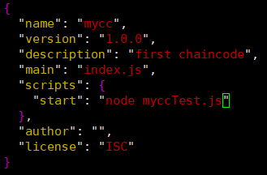

### 名词回顾

##### Hyperledger Fabric

第一个孵化出来的商用DLT框架

##### DLT

distribute ledger technology，分布式存储的是账本：book of records，DLT问题：隐私/机密/标准化，传统区块链无法解决

##### Hyperledger composer

DLT上创建商业应用的工具

##### 关键组件

peer节点、ordering service排序服务、ca证书中心、msp会员管理提供者；

使用nodejs编写链码（智能合约）

资产assert代表的是价值，资产变更会生成转账transaction（或者叫做事务）

### 重建信任

hyperledger是区块链技术，但不是数字货币，没有挖矿的概念。但其可以创造数字货币

### 数据完整性和安全性


账本由密码学签名保证

permissioned network： 授权网络 access control

confidential transaction 交易安全 transaction是可以控制可见性的

> 可以创建私有channel


no cryptocurrency 无数字货币：不用分析51%攻击？

> 没有矿工，低成本，验证操作灵活
>
> ​	programmable 可编程
>
> ​	chaincode 智能合约 链码（在hyperledger特有名词）

可以创建公有链，私有链，联盟链

每个共识协议的参与者都是由CA来认证

### Assert，chaincode&ledger

assert：有价值的东西，可以被交易的东西

> json表示；
>
> 二进制表示

chaincode

> transaction | business logic业务逻辑

ledger

> 记录所有的transaction

所有参与者都保存了ledger

hyperledger相当于存有“两套账本”：交易信息和世界状态

code is law

背书策略：提供一种规则，例如：几个参与者同意后可以出发智能合约

java开销太大，go编写比较麻烦，官方推荐nodejs

### 授权网络和MSP和CA

业务参与要求整个网络的参与者是认识的，实名制的（认证）

MSP：Membership Service Provider：Roles & Access Restrictions

#### 授权网络：修改网络必须由数字签名（x.509标准）

**<u>fabirc ca</u>**是一个高质量的工具，帮助我们生成证书，ca可以为不同用户生成不同的证书，fabric ca支持链式继承，参与者无法抵赖。

MSP是一个接口/规范，可拔插，支持各种认证体系结构，为membership orchestration architecture提供抽象层：提供具体的身份格式、用户证书验证、用户证书撤销、签名生成和验证，Fabric-CA用于生成证书和密钥，以真正的初始化MSP。

fabric-ca是用于身份管理的MSP接口的默认实现。

MSP定义你是谁，你在哪个网络，msp的证书由f-ca来颁发，每个peer都需要msp的证书。MSPID是一个名字定义一组证书，例如某个机构的某一个成员都需要一个mspid，使用hyperledger fabric sdk的时候经常就需要指定mspid。

### Node：peer、client&orderer

node是区块链的通讯终端，以太坊中node都是相同的，在hyperledger中node分为三种：

- client：实例化transaction的（cli 命令行，node sdk：nodejs，java sdk）
- peer：用来存储和同步ledger的数据
- orderer：用来排序分发transaction，类似于矿工


排序很重要，解决双花问题（并发），创建区块，对区块签名和验证。

### Channel

每个channel可以理解为独立的HF的实例，所有channel是完全独立的，或者理解为一个子网？

不同channel之间不会交换数据（群聊）

一个channel不依赖其他channel

peer默认什么事情都不做，peer要加入到channel之后才能有blockchain，update ledger

sdk有个工具configtx来让peer加入channel、configtxlator修改channel配置

### Chaincode：nodejs/java/go

智能合约，是应用程序

用来更新账本数据，且只能用chaincode

sdk发起一个transaction（client），peer执行chaincode

chaincode必须属于某一个channel，ledger属于某个channel，chaincode操作的是ledger：当你执行一个操作的时候你需要出示你的权限（ca）

chaincode需要在channel中的每个peer安装，否则会导致peer数据不一致，从而对某些错误peer进行踢出

#### chaincode生命周期

chaincode需要先安装，然后必须实例化，实例化chaincode会启动docker容器，在容器里运行chaincode：

- 安装install

- 实例化init

  在hf里chaincode都是在docker容器里运行

- 调用invoke

#### chaincode背书策略

实例化chaincode需要指定背书策略


### Hyperledger工作流程


> orderer:solo排序算法-------> kafka（实际使用）------> SBFT  PBFT
>
>  提案-背书-更新申请-调用/更新
>
> 背书成功，验证通过，数据一致才会更新账本数据


### 术语回顾


### Docker

[Docker 教程 | 菜鸟教程 (runoob.com)](https://www.runoob.com/docker/docker-tutorial.html)

##### 思想

标准化、模块化

安全性：隔离

##### 解决问题

- devops
- 易扩展
- 弹性计算
- 限制CPU资源

##### 原理

标准化：build、ship、run

1. 构建镜像发布到仓库；
2. 去仓库拉镜像到本地；
3. 把本地的镜像运行起来，运行在容器中

#### 仓库镜像

##### 联合分层文件系统


自上而下发现

Container以下只需要启动一次

#### 容器

其实就是一个虚拟进程

#### 仓库

hub.docker.com

#### docker安装

参考阿里云镜像资源对应的安装教程：[docker-ce镜像_docker-ce下载地址_docker-ce安装教程-阿里巴巴开源镜像站 (aliyun.com)](https://developer.aliyun.com/mirror/docker-ce?spm=a2c6h.13651102.0.0.57e31b11I1BQed)

使用docker拉去nginx镜像：`docker pull nginx`，默认为latest版本

运行nginx：`docker run -p 主机端口:docker端口 -d(后台运行) --name name(docker命名) nginx`

### Hyperledger环境搭建

官方文档：[Using the Fabric test network — hyperledger-fabricdocs main documentation](https://hyperledger-fabric.readthedocs.io/en/latest/test_network.html)

在docker中安装，必要内容下载

下载fabric-samples：`curl -sSL https://raw.githubusercontent.com/hyperledger/fabric/main/scripts/bootstrap.sh| bash -s`

> 采用官方脚本下载，速度很慢，因为有wall：下载内容包括二进制文件 fabric binaries（国内服务器1h24min，很晕）

在linux（ubuntu）里，fabric-samples会比在windows下多一个bin文件夹：


进入文件夹，里面是一些fabric会用到的一些工具：


docker-compose是一个docker的一个批处理工具，可以一次性启动很多个docker

##### 安装docker-compose

官方文档：[Install the Compose standalone (docker.com)](https://docs.docker.com/compose/install/other/)

文档使用：`curl -SL https://github.com/docker/compose/releases/download/v2.16.0/docker-compose-linux-x86_64 -o /usr/local/bin/docker-compose`

这样会很慢很慢：可以改成：`curl -SL https://github.com/docker/compose/releases/download/v2.16.0/docker-compose-'uname -s'-'uname -m' -o /usr/local/bin/docker-compose`

> 注意这里的v2.16.0，可以根据需要换成对应的版本，特别是注意看官方版本是否带 `v`

完成后：`docker compose version`验证是否安装成功，成功后会显示：

```shell
Docker Compose version v2.16.0
```

##### 安装Go环境

直接：

`apt-get update`

`apt-get install golang`

这种aliyun镜像安装的是1.13版本太低了，目前最好安装1.18（2023-3-9）

官网下载

[All releases - The Go Programming Language (google.cn)](https://golang.google.cn/dl/)

```bash
wget https://golang.google.cn/dl/go1.18.5.linux-amd64.tar.gz
```

```shell
tar -xfzv go1.18.10.linux-amd64.tar.gz -C /usr/local
```

修改环境配置：

```shell
sudo vim /etc/profile

#在最后添加：
export GOROOT=/usr/local/go
export GOPATH=$HOME/gowork
export GOBIN=$GOPATH/bin
export PATH=$GOPATH:$GOBIN:$GOROOT/bin:$PATH

#保存退出
cd ~ 
vim .bashrc
#将以下命令写在最后
source /etc/profile

#执行一下
source /etc/profile

#检查go是否安装好
go env

#会出现以下信息：
GO111MODULE="on"
GOARCH="amd64"
GOBIN="/root/gowork/bin"
GOCACHE="/root/.cache/go-build"
GOENV="/root/.config/go/env"
GOEXE=""
GOEXPERIMENT=""
GOFLAGS=""
GOHOSTARCH="amd64"
GOHOSTOS="linux"
GOINSECURE=""
GOMODCACHE="/root/gowork/pkg/mod"
GONOPROXY=""
GONOSUMDB=""
GOOS="linux"
GOPATH="/root/gowork"
GOPRIVATE=""
GOPROXY="https://proxy.golang.org,direct"
GOROOT="/usr/local/go"
GOSUMDB="sum.golang.org"
GOTMPDIR=""
GOTOOLDIR="/usr/local/go/pkg/tool/linux_amd64"
GOVCS=""
GOVERSION="go1.18.10"
...
```

使用以下两个命令，将go的代理换为国内代理

`go env -w GOPROXY=https://goproxy.io,direct`

`go env -w GO111MODULE=on`

##### HF测试网络

进入到目录：`/fabric-samples/test-network` 可以运行测试网络

运行：

```shell
#关闭网络已创建的容器
./network.sh down
#启动测试网络
./network.sh up 
```

会得到类似以下结果

```shell
Creating network "fabric_test" with the default driver
Creating volume "net_orderer.example.com" with default driver
Creating volume "net_peer0.org1.example.com" with default driver
Creating volume "net_peer0.org2.example.com" with default driver
Creating peer0.org2.example.com ... done
Creating orderer.example.com    ... done
Creating peer0.org1.example.com ... done
Creating cli                    ... done
CONTAINER ID   IMAGE                               COMMAND             CREATED         STATUS                  PORTS                                            NAMES
1667543b5634   hyperledger/fabric-tools:latest     "/bin/bash"         1 second ago    Up Less than a second                                                    cli
b6b117c81c7f   hyperledger/fabric-peer:latest      "peer node start"   2 seconds ago   Up 1 second             0.0.0.0:7051->7051/tcp                           peer0.org1.example.com
703ead770e05   hyperledger/fabric-orderer:latest   "orderer"           2 seconds ago   Up Less than a second   0.0.0.0:7050->7050/tcp, 0.0.0.0:7053->7053/tcp   orderer.example.com
718d43f5f312   hyperledger/fabric-peer:latest      "peer node start"   2 seconds ago   Up 1 second             7051/tcp, 0.0.0.0:9051->9051/tcp                 peer0.org2.example.com
```

运行`./network.sh up`时，会看到cryptogen工具正在创建Org1，Org2和Orderer Org的证书和密钥。

创建了，cli，peer0，peer1和orderer；再运行：

```shell
./network.sh createChannel
```

最终会创建mychannel，并且加入网络


也可以自定义指定channel

前两步可以结合

```
./network.sh up createChannel
```

`./network.sh down`是关闭当前网络，并且释放容器

<a name="chaincode-go">在通道上启动chaincode</a>：`./network.sh deployCC -ccn basic -ccp ../asset-transfer-basic/chaincode-go -ccl go`

([手动创建网络使用go](#chaincode-mycc-nodejs))

注意：可能会出现以下报错：

```shell
...
ng --label basic_1.0
+ res=1
++ peer lifecycle chaincode calculatepackageid basic.tar.gz
Error: failed to read chaincode package at 'basic.tar.gz': open basic.tar.gz: no such file or directory
+ PACKAGE_ID=
Error: failed to normalize chaincode path: 'go list' failed with: go: updates to go.mod needed; to update it:
	go mod tidy: exit status 1
Chaincode packaging has failed
Deploying chaincode failed

```

这个时候进入`../asset-transfer-basic/chaincode-go`路径下，执行：`go mod tidy`会对依据当前go版本对go.mod文件进行更新：


执行成功后会出现以下结果：


#### Anchor peer 锚节点

同一个网络（同一个org）的peer是能够互相发现的，所以能马上同步数据，但是不同Org的peer并不在一个网络中，就需要Anchor peer来进行通信（采用gossip协议：”一传十，十传百“）

### 与网络交互

当把chaincode部署好之后，可以使用peer CLI与网络进行交互，peer CLI允许调用已部署的只能合约来更新通道，或者安装和部署新的智能合约。

eg：在test-network目录下操作：在`fabric-samples`代码库的`bin`文件夹中找到`peer`二进制文件。 使用以下命令将这些二进制文件添加到您的CLI路径：

```shell
export PATH=${PWD}/../bin:$PATH
```

还需要将`fabric-samples`代码库中的`FABRIC_CFG_PATH`设置为指向其中的`core.yaml`文件：

```shell
export FABRIC_CFG_PATH=$PWD/../config/
```

可以设置环境变量，以允许您作为Org1操作`peer` CLI：

```shell
# Environment variables for Org1

export CORE_PEER_TLS_ENABLED=true 
export CORE_PEER_LOCALMSPID="Org1MSP"

#CORE_PEER_TLS_ROOTCERT_FILE和CORE_PEER_MSPCONFIGPATH环境变量指向Org1的organizations文件夹中的的加密材料
export CORE_PEER_TLS_ROOTCERT_FILE=${PWD}/organizations/peerOrganizations/org1.example.com/peers/peer0.org1.example.com/tls/ca.crt
export CORE_PEER_MSPCONFIGPATH=${PWD}/organizations/peerOrganizations/org1.example.com/users/Admin@org1.example.com/msp
export CORE_PEER_ADDRESS=localhost:7051 

#如果使用 ./network.sh deployCC -ccl go 安装和启动 asset-transfer (basic) 链码，您可以调用链码（Go）的 InitLedger 方法来赋予一些账本上的初始资产（如果使用 typescript 或者 javascript，例如 ./network.sh deployCC -l javascript，你会调用相关链码的 initLedger 功能）--来自官方文档
```

运行以下命令用一些资产来初始化账本：

```shell
peer chaincode invoke -o localhost:7050 --ordererTLSHostnameOverride orderer.example.com --tls --cafile ${PWD}/organizations/ordererOrganizations/example.com/orderers/orderer.example.com/msp/tlscacerts/tlsca.example.com-cert.pem -C mychannel -n basic --peerAddresses localhost:7051 --tlsRootCertFiles ${PWD}/organizations/peerOrganizations/org1.example.com/peers/peer0.org1.example.com/tls/ca.crt --peerAddresses localhost:9051 --tlsRootCertFiles ${PWD}/organizations/peerOrganizations/org2.example.com/peers/peer0.org2.example.com/tls/ca.crt -c '{"function":"InitLedger","Args":[]}'
```

如果命令成功，您将观察到类似以下的输出：

```shell
-> INFO 001 Chaincode invoke successful. result: status:200
```


可以使用CLI工具来查询账本，运行以下指令来获取添加到通道账本的资产列表：

```shell
peer chaincode query -C mychannel -n basic -c '{"Args":["GetAllAssets"]}'
```

如果成功，将看到类似以下输出：

```shell
[
  {"ID": "asset1", "color": "blue", "size": 5, "owner": "Tomoko", "appraisedValue": 300},
  {"ID": "asset2", "color": "red", "size": 5, "owner": "Brad", "appraisedValue": 400},
  {"ID": "asset3", "color": "green", "size": 10, "owner": "Jin Soo", "appraisedValue": 500},
  {"ID": "asset4", "color": "yellow", "size": 10, "owner": "Max", "appraisedValue": 600},
  {"ID": "asset5", "color": "black", "size": 15, "owner": "Adriana", "appraisedValue": 700},
  {"ID": "asset6", "color": "white", "size": 15, "owner": "Michel", "appraisedValue": 800}
]
```


当一个网络成员希望在账本上转一些或者改变一些资产，链码会被调用。使用以下的指令来通过调用 asset-transfer (basic) 链码改变账本上的资产所有者：

```shell
peer chaincode invoke -o localhost:7050 --ordererTLSHostnameOverride orderer.example.com --tls --cafile ${PWD}/organizations/ordererOrganizations/example.com/orderers/orderer.example.com/msp/tlscacerts/tlsca.example.com-cert.pem -C mychannel -n basic --peerAddresses localhost:7051 --tlsRootCertFiles ${PWD}/organizations/peerOrganizations/org1.example.com/peers/peer0.org1.example.com/tls/ca.crt --peerAddresses localhost:9051 --tlsRootCertFiles ${PWD}/organizations/peerOrganizations/org2.example.com/peers/peer0.org2.example.com/tls/ca.crt -c '{"function":"TransferAsset","Args":["asset6","Christopher"]}'
```

如果命令成功，应该看到以下响应（以当时实验为例）：

```shell
2023-03-10 16:31:38.107 CST 0001 INFO [chaincodeCmd] chaincodeInvokeOrQuery -> Chaincode invoke successful. result: status:200 payload:"Michel" 
```


官方文档解释：因为 asset-transfer (basic) 链码的背书策略需要交易同时被 Org1 和 Org2 签名，链码调用指令需要使用 ：

`--peerAddresses` 标签来指向 `peer0.org1.example.com` 和 `peer0.org2.example.com`。

因为网络的 TLS 被开启，指令也需要用：

 `--tlsRootCertFiles` 标签指向每个 peer 节点的 TLS 证书。

查看以下路径文件的内容：

```shell
${PWD}/organizations/ordererOrganizations/example.com/orderers/orderer.example.com/msp/tlscacerts/tlsca.example.com-cert.pem
```

可以看到证书内容为如下：


调用链码之后，我们可以使用另一个查询来查看调用如何改变了区块链账本的资产。因为我们已经查询了 Org1 的 peer，我们可以把这个查询链码的机会通过 Org2 的 peer 来运行。设置以下的环境变量来操作 Org2：

```shell
# Environment variables for Org2

export CORE_PEER_TLS_ENABLED=true
export CORE_PEER_LOCALMSPID="Org2MSP"
export CORE_PEER_TLS_ROOTCERT_FILE=${PWD}/organizations/peerOrganizations/org2.example.com/peers/peer0.org2.example.com/tls/ca.crt
export CORE_PEER_MSPCONFIGPATH=${PWD}/organizations/peerOrganizations/org2.example.com/users/Admin@org2.example.com/msp
export CORE_PEER_ADDRESS=localhost:9051
```

你可以查询运行在 `peer0.org2.example.com` asset-transfer (basic) 链码：

```shell
peer chaincode query -C mychannel -n basic -c '{"Args":["ReadAsset","asset6"]}'
```

结果显示 `"asset6"` 转给了 Christopher:

```shell
root@host:~/fabric-samples/test-network#
peer chaincode query -C mychannel -n basic -c '{"Args":["ReadAsset","asset6"]}'
#结果
{"AppraisedValue":800,"Color":"white","ID":"asset6","Owner":"Christopher","Size":15}
```


以上则为与网络交互的整个流程。

##### 补充：测试网络脚本还提供了使用证书颁发机构（CA）的网络的启动选项

在使用ca启动前，应该down掉当前网络，然后使用：

```
./network.sh up -ca
```


值得花一些时间检查`/ network.sh`脚本部署CA之后生成的日志：

测试网络使用Fabric CA客户端以每个组织的CA注册节点和用户身份。 之后这个脚本使用enroll命令为每个身份生成一个MSP文件夹。 MSP文件夹包含每个身份的证书和私钥，以及在运营CA的组织中建立身份的角色和成员身份。 可以使用以下命令来检查Org1管理员用户的MSP文件夹：

```shell
tree organizations/peerOrganizations/org1.example.com/users/Admin@org1.example.com/
```

该命令将显示MSP文件夹的结构和配置文件：


可以在`signcerts`文件夹中找到管理员用户的证书，然后在`keystore`文件夹中找到私钥。

cryptogen和Fabric CA都为每个组织在`organizations`文件夹中生成加密材料。 您可以在`organizations/fabric-ca`目录中的`registerEnroll.sh`脚本中找到用于设置网络的命令。


以下是官方文档对整个过程的幕后做的解释：

> 如果您有兴趣了解有关示例网络的更多信息，则可以调查`test-network`目录中的文件和脚本。 下面的步骤提供了有关在您发出`./network.sh up`命令时会发生什么情况的导览。
>
> - `./ network.sh`为两个对等组织和排序组织创建证书和密钥。 默认情况下，脚本利用cryptogen工具使用位于`organizations/cryptogen`文件夹中的配置文件。 如果使用`-ca`标志创建证书颁发机构，则脚本使用Fabric CA服务器配置文件和位于`organizations/fabric-ca`文件夹的`registerEnroll.sh`脚本。 cryptogen和Fabric CA均会在`organisations`文件夹创建所有三个组织中的加密资料和MSP文件夹。
> - 该脚本使用configtxgen工具创建系统通道生成块。 Configtxgen使用了`TwoOrgsOrdererGenesis`通道配置文件中的`configtx/configtx.yaml`文件创建创世区块。 区块被存储在`system-genesis-block`文件夹中。
> - 一旦组织的加密资料和系统通道的创始块生成后，`network.sh`就可以启动网络的节点。 脚本使用`docker`文件夹中的`docker-compose-test-net.yaml`文件创建对等节点和排序节点。 `docker`文件夹还包含 `docker-compose-e2e.yaml`文件启动网络节点三个Fabric CA。 该文件旨在用于Fabric SDK 运行端到端测试。 请参阅[Node SDK](https://github.com/hyperledger/fabric-sdk-node)代码库有关运行这些测试的详细信息。
> - 如果您使用`createChannel`子命令，则`./ network.sh`使用提供的频道名称， 运行在`scripts`文件夹中的`createChannel.sh`脚本来创建通道。 该脚本使用`configtx.yaml`文件来创建通道创作事务，以及两个锚对等节点更新交易。 该脚本使用对等节点cli创建通道，加入`peer0.org1.example.com`和`peer0.org2.example.com` 到频道， 以及使两个对等节点都成为锚对等节点。
> - 如果执行`deployCC`命令，`./ network.sh`会运行`deployCC.sh`脚本在两个 peer 节点上安装**asset-transfer (basic)**链码， 然后定义通道上的链码。 一旦将链码定义提交给通道，对等节点cli使用`Init`初始化链码并调用链码将初始数据放入账本。

更多详情查看官方文档--中文：[使用Fabric的测试网络 — hyperledger-fabricdocs master 文档](https://hyperledger-fabric.readthedocs.io/zh_CN/latest/test_network.html#)

### 二进制文件

在使用脚本拉取fabric-sample的时候下载的二进制文件，实际就是bin文件夹里的内容：

`~/fabric-samples/bin`


### hyperleadger组成结构理解

hyperledger网络可以有多个组织（Org）

- 一个组织可以有多个peer（电脑/终端），同步数据记账
- 一个组织可以有一个或者多个用户（一个用户可以管理多个peer）
- 一个组织内部必须有一个admin管理员

### 手动End-2-End测试（手动创建网络）

| 文件名                                  | 文件类型                     | 文件作用                                                     |
| --------------------------------------- | ---------------------------- | ------------------------------------------------------------ |
| [crypto-config.yaml](#cryptoconfig)     | yaml配置文件                 | 用于定义组织（Orgs）、Orderer、peer节点、用户数量；使用cryptogen可以生成模板配置文件 |
| [organizations](#organizations)         | 文件夹                       | 通过使用crypto-config.yaml生成，用于存放各个节点的公钥、ca证书、tls等相关信息 |
| [configtx.yaml](#configtx)              | yaml配置文件                 | 配置各个节点具体信息，包括mspid、org的策略和锚节点、网络的能力配置、applications的策略（用来配置写入创世区块的参数）、orderer使用的排序配置、channel的配置信息、策略等 |
| [channel-artifacts](#channel-artifacts) | 文件夹                       | 用于存放创世区块(也可以自己定义在其他文件夹，参考创建创世区块的具体命令行代码)、channel信息、各个org的锚节点信息等 |
| [compose-mynet.yaml](#compose-mynet)    | yaml配置文件(docker-compose) | docker-compose配置文件，用于配置各个节点容器的相关信息，包括镜像、环境、端口映射、网络等信息 |

1. 创建文件夹my-network：定义who is who

   在./fabric-samples下`mkdir my-network`

2. <a name='cryptoconfig'>配置文件</a>

   定义组织（Orgs）、Orderer（可以定义多个）、用户数量

   <font color=red>生成证书：</font>

   这里利用`cryptogen`工具来生成证书文件，可以先用`cryptogen showtemplate`生成一份模板证书配置文件

   ```shell
   cryptogen showtemplate > crypto-config.yaml  # 生成一份模板证书配置文件
   ```

   ```yaml
   
   OrdererOrgs: 									#orderer组织的配置
   
     - Name: Orderer 								#组织名
       Domain: example.com							#组织的域名
       EnableNodeOUs: false						#设置了EnableNodeOUs，会在map下生成config.yaml文件，OU：组织单元，模板生成的是false
       Specs:
         - Hostname: orderer						# 生成的证书文件会以{{Hostname}}.{{Domain}}呈现
           SANS:
         	  - localhost								# orderer.example.com
   
   
   PeerOrgs:									# 每个peer组织配置（机构）
   
     - Name: Org1								# 机构名称
       Domain: org1.example.com				# 机构的域名
       EnableNodeOUs: true
       #这里template根据count来生成指定份数的证书文件
       #对于Template的原英文注解：
       # ---------------------------------------------------------------------------
       # "Template"
       # ---------------------------------------------------------------------------
       # Allows for the definition of 1 or more hosts that are created sequentially
       # from a template. By default, this looks like "peer%d" from 0 to Count-1.
       # You may override the number of nodes (Count), the starting index (Start)
       # or the template used to construct the name (Hostname).
       #
       # Note: Template and Specs are not mutually exclusive.  You may define both
       # sections and the aggregate nodes will be created for you.  Take care with
       # name collisions
       # ---------------------------------------------------------------------------
       # peer命名由0开始到count-1，规则是peer%d，eg：peer0，当然可以自由指定开始的节点，由Start指定
       Template:
         Count: 2								#我这里改成2，应该就会生成两个peer
         # Start: 5   指定生成的节点从几开始，不指定就从0开始　peer0.org1.example.com
         # Hostname: {{.Prefix}}{{.Index}} # default
         # SANS:
         #   - "{{.Hostname}}.alt.{{.Domain}}"
         SANS:
         	- localhost
       Users:				# 组织中除了Admin之外还需要生成多少个用户，数量由count决定：Count: The number of user accounts _in addition_ to Admin
         Count: 1
   
     - Name: Org2
       Domain: org2.example.com
       EnableNodeOUs: true
       Template:
         Count: 2
         SANS:
         	- localhost
       Users:
         Count: 1
   
   ```

   注意：SANS一定要填节点真实的地址，不然会导致后面加入通道加不进去

   <a name='organizations'>然后使用以下命令生成证书：</a>

   ```shell
   cryptogen generate --config=./crypto-config.yaml --output=organizations
   ```

   创建成功后会有以下显示

   

   tree一下：

   

   

   可以发现，创建了orderer组织和peer组织，并且按照之前写的yaml配置文件生成了对应的peer节点和users，以及ca、msp、tlsca

   <font color=blue>tlsca，tls是现在用与替换ssl的一种新的安全协议，目前HF中使用的就是tls协议</font>

   <font color=red>---------------------------2.x和1.x配置方法有不同，还需另外学习------------------------------</font>

   > OU：organization unit组织单位
   >
   > 
   >
   > 我这里是直接在my-network目录下使用../bin cryptogen xxxxxx来调用cryptogen，为了之后更方便，把../bin直接加入环境变量：
   >
   > ```shell
   > export PATH=${PWD}/../bin:${PWD}:$PATH
   > 
   > #将../bin加入环境变量后，再来试试，注意这里需要删除之前生成的文件
   > #也就是要删除organizations
   > 
   > rm -rf organizations
   > cryptogen generate --config=./crypto-config.yaml --output=organizations
   > # 得到以下输出
   > org1.example.com
   > org2.example.com
   > # 这下就可以直接使用cryptogen了
   > ```

3. <a name='configtx'>创世区块配置和生成</a>

   在创世区块里，写入初始参与者所有用户的信息，这样后来加入的用户则无法修改msp中相关信息。（由Hash指向区块）黑客创造一个假的peer节点，没有大家的数字签名证书，则无法与其他节点通讯。

   注：Fabric2.x排序类型使用EtcdRaft

   当前网络的org定义

   id：就是msp id。所有操作都是通过mspid来定义，定义某个证书的名称，对应MSPDIR。

   > 生成创世区块也需要一份配置文件`configtx.yaml` 我这里直接复制了`test-network/configtx/configtx.yaml`下面的
   >
   > ```yaml
   > Organizations:
   >     - &OrdererOrg
   >         Name: Orderer     # 组织名称，要与之前config文件中的名称对应，一定一定得一致
   >         ID: OrdererMSP        # 组织id 用来引用组织   
   >         MSPDir: organizations/ordererOrganizations/example.com/msp    # 组织的msp文件目录
   >         Policies:         # 定义组织的一些策略
   >             Readers:
   >                 Type: Signature
   >                 Rule: "OR('OrdererMSP.member')"
   >             Writers:
   >                 Type: Signature
   >                 Rule: "OR('OrdererMSP.member')"
   >             Admins:
   >                 Type: Signature
   >                 Rule: "OR('OrdererMSP.admin')"
   >                 
   >         OrdererEndpoints:
   >             - orderer.example.com:7050
   >             
   >     - &Org1
   >         Name: Org1
   >         ID: Org1MSP
   >         MSPDir: organizations/peerOrganizations/org1.example.com/msp
   >         Policies:
   >             Readers:
   >                 Type: Signature
   >                 Rule: "OR('Org1MSP.admin', 'Org1MSP.peer', 'Org1MSP.client')"
   >             Writers:
   >                 Type: Signature
   >                 Rule: "OR('Org1MSP.admin', 'Org1MSP.client')"
   >             Admins:
   >                 Type: Signature
   >                 Rule: "OR('Org1MSP.admin')"
   >             Endorsement:
   >                 Type: Signature
   >                 Rule: "OR('Org1MSP.peer')"
   >         AnchorPeers:                       # 定义组织的锚节点，原文件中并没有定义，如果没有定义之后更新锚节点就无法找到原有的锚节点，可能需要其他方法来定义
   >             - Host: peer0.org1.example.com # 锚节点的host地址
   >               Port: 7051                   # 锚节点开放的端口号地址
   >                  
   >     - &Org2
   >         Name: Org2
   >         ID: Org2MSP
   >         MSPDir: organizations/peerOrganizations/org2.example.com/msp
   >         Policies:
   >             Readers:
   >                 Type: Signature
   >                 Rule: "OR('Org2MSP.admin', 'Org2MSP.peer', 'Org2MSP.client')"
   >             Writers:
   >                 Type: Signature
   >                 Rule: "OR('Org2MSP.admin', 'Org2MSP.client')"
   >             Admins:
   >                 Type: Signature
   >                 Rule: "OR('Org2MSP.admin')"
   >             Endorsement:
   >                 Type: Signature
   >                 Rule: "OR('Org2MSP.peer')"
   >         AnchorPeers:
   >             - Host: peer0.org2.example.com
   >               Port: 9051
   > 
   > # fabric网络的能力配置部分              
   > Capabilities:
   >     Channel: &ChannelCapabilities           # Channel配置同时应用于orderer和peer
   >         V2_0: true
   >     Orderer: &OrdererCapabilities        # Orderer仅使用于orderer,无需担心升级peer     
   >         V2_0: true
   >     Application: &       # Application仅使用于Peer,无需担心升级Orderer   
   >         V2_0: true
   > 
   > # Application配置用来定义要写入创世区块或配置交易的应用参数        
   > Application: &ApplicationDefaults
   >     Organizations:
   >     Policies:
   >         Readers:
   >             Type: ImplicitMeta
   >             Rule: "ANY Readers"
   >         Writers:
   >             Type: ImplicitMeta
   >             Rule: "ANY Writers"
   >         Admins:
   >             Type: ImplicitMeta
   >             Rule: "MAJORITY Admins"
   >         LifecycleEndorsement:
   >             Type: ImplicitMeta
   >             Rule: "MAJORITY Endorsement"
   >         Endorsement:
   >             Type: ImplicitMeta
   >             Rule: "MAJORITY Endorsement"
   >     # Capabilities配置描述应用层级的能力需求
   >     # 这里引用了 前面定义的 &ApplicationCapabilities 锚点 也就是Application的值放在这
   >     Capabilities:
   >         <<: *ApplicationCapabilities
   >         
   > # Orderer配置用来定义要编码写入创世区块或通道交易的排序节点参数       
   > Orderer: &OrdererDefaults 
   >     OrdererType: etcdraft      # 排序节点的类型 目前有 solo kafka EtcdRaft , 不同的类型对应不同的共识算法的实现
   >     Addresses:     # orderer 服务的地址  
   >         - orderer.example.com:7050
   > 
   >     EtcdRaft:        # EtcdRaft排序类型的配置
   >         Consenters:
   >         - Host: orderer.example.com
   >           Port: 7050
   >           ClientTLSCert: organizations/ordererOrganizations/example.com/orderers/orderer.example.com/tls/server.crt
   >           ServerTLSCert: organizations/ordererOrganizations/example.com/orderers/orderer.example.com/tls/server.crt
   >     BatchTimeout: 1s    # 区块打包的时间,到了这个时间就打包区块
   >     BatchSize:          # 区块打包的最大包含交易数
   >         MaxMessageCount: 10       # 一个区块里最大的交易数
   >         AbsoluteMaxBytes: 99 MB   # 一个区块的最大字节数,任何时候都不能超过
   >         PreferredMaxBytes: 512 KB # 一个区块的建议字节数    # 这里的配置好像没有作用目前我也不知道是啥情况
   >         #可以根据实际情况，对上述几个数据进行调整，来优化区块链网络的处理速度
   >     Organizations:
   >     Policies:
   >         Readers:
   >             Type: ImplicitMeta
   >             Rule: "ANY Readers"
   >         Writers:
   >             Type: ImplicitMeta
   >             Rule: "ANY Writers"
   >         Admins:
   >             Type: ImplicitMeta
   >             Rule: "MAJORITY Admins"
   >         BlockValidation:
   >             Type: ImplicitMeta
   >             Rule: "ANY Writers"
   > 
   > # Channel配置用来定义要写入创世区块或配置交易的通道参数
   > Channel: &ChannelDefaults
   >     Policies:
   >         Readers:
   >             Type: ImplicitMeta
   >             Rule: "ANY Readers"
   >         Writers:
   >             Type: ImplicitMeta
   >             Rule: "ANY Writers"
   >         Admins:
   >             Type: ImplicitMeta
   >             Rule: "MAJORITY Admins"
   >     Capabilities:
   >         <<: *ChannelCapabilities
   >         
   > # Profiles配置用来定义用于configtxgen工具生成创世区块或配置块的一些配置信息
   > #以下的内容很关键，注意两个内容的命名，生成创世区块是需要的，复制的文件与以下配置不一样（可能是TwoOrgsApplicationGenesis），注意名称
   > Profiles:
   >     
   >     TwoOrgsApplicationGenesis:
   >     # 用来生成orderer启动时所需的block,用于生成创世区块
   >         <<: *ChannelDefaults
   >         Orderer:
   >             <<: *OrdererDefaults
   >             Organizations:
   >                 - *OrdererOrg
   >             Capabilities: *OrdererCapabilities
   >         Application:
   >             <<: *ApplicationDefaults
   >             Organizations:
   >                 - *Org1
   >                 - *Org2
   >             Capabilities: *ApplicationCapabilities
   >         Consortiums:
   >           # 这里定义了一个联盟 
   >             SampleConsortium:
   >                 Organizations:
   >                     - *Org1
   >                     - *Org2
   > 
   >     # TwoOrgsChannel用来生成channel配置信息                
   >     TwoOrgsChannel:
   >         Consortium: SampleConsortium # 引用上面定义的联盟
   >         <<: *ChannelDefaults
   >         Application:
   >             <<: *ApplicationDefaults
   >             Organizations:
   >                 - *Org1
   >                 - *Org2
   >             Capabilities:
   >                 <<: *ApplicationCapabilities
   > 
   > ```

   <font color=red><<: * 的操作，其实就是复制，将名称为后面跟的内容的信息复制在对应位置，避免代码冗余</font>

   <a name='channel-artifacts'>使用configexgen工具来生成创世区块：</a>

   ```shell
   configtxgen -configPath ./ -profile TwoOrgsApplicationGenesis -channelID mychannel -outputBlock ./channel-artifacts/genesis.block
   ```

   <font color=red>一定要注意organizations的地址复制过来的文件，为../organizations，而当前我们创建的是./organizations</font>

   还有就是Profile部分的Orderer的命名一定要在路径中使用正确

   执行代码后：

   

   查看最终生成的内容：

   

   生成了一个创世区块，查看创世区块的内容为各个节点的公钥信息、权限等：

   ```text
   
   " ???8?7@?;?ewSy|???? 
   ? 
    
   w                                                                                                                                                                                           ???"	mychannel*@a2828664dcd7526532e97b6904878fe2a443bd0c810299d265eeaf28659591cf?B??4<En?`??? 
   W?¤;
   Orderer;*
   
   OrdererOrg*?(
   MSP(((
   
   OrdererMSP?-----BEGIN CERTIFICATE-----
   MIICPTCCAeOgAwIBAgIQcMcIX11bsTEphuoz2dUVhDAKBggqhkjOPQQDAjBpMQsw
   CQYDVQQGEwJVUzETMBEGA1UECBMKQ2FsaWZvcm5pYTEWMBQGA1UEBxMNU2FuIEZy
   YW5jaXNjbzEUMBIGA1UEChMLZXhh.....
   .....
   .....
   .....
   .....
   -----END CERTIFICATE-----
   ordererAdmins1
   	Endpoints$ 
   orderer.example.com:7050Admins"3
   Writers( 
   
   
   OrdererMSPAdmins"4
   Admins* 
   
   OrdererMSPAdmins"3
   Readers( 
   
   
   OrdererMSPAdmins*Admins"
   	BatchSize 
   
   ?? Admins 
   
   BatchTimeout 
   2sAdmins 
   ChannelRestrictionAdmins$
   
   Capabilities 
   
   V2_0Admins 
   ConsensusTypeR?                                                                                                                                                                             etcdraft?
    
   orderer.example.com7??--BEGIN CERTIFICATE-----
   MIICZDCCAgqgAwIBAgIQGNkB1l1vXVZrXjnwXz/fmTAKBggqhkjOPQQDAjBsMQsw
   CQYDVQQGEwJVUzETMBEGA1UECBMKQ2FsaWZvcm5pYTEWMBQGA1UEBxMNU2FuIEZy
   YW5jaXNjbzEUMBIGA1UEChMLZXhhbXBsZS5jb20xGjAYBgNVBAMTEXRsc2NhLmV4
   YW1wbGUuY29tMB4XDTIzMDMxMzA4MjYwMFoXD.....
   .....
   ....
   ....
   .....
    
   500ms 
    Admins"*                                                                                                                                                                                   	
   WritersAdmins""                                                                                                                                                                             	
   ReadersAdmins""                                                                                                                                                                             	
   WritersAdmins""
   Admins 
   
   AdminsAdmins*Admins? 
   
   Application? 
   Org1MSP??
   MSP?)?)°)
   Org1MSP?----BEGIN CERTIFICATE-----
   MIICUjCCAfegAwIBAgIQYv+L5fS92hZ5MDVAU2TxOzAKBggqhkjOPQQDAjBzMQsw
   CQYDVQQGEwJVUzETMBEGA1UECBMKQ2FsaWZvcm5pYTEWMBQGA1UEBxMNU2FuIEZy
   YW5jaXNjbzEZMBcGA1UEChMQb3JnMS5leGFtcGxlLmNvbTEcMBoGA1UEAxMTY2Eu
   b3JnMS5leGFtcG....
   .....
   ....
   ....
   
   ordererAdmins"E
   Writers:, 
                                                                                                                                                                                                
   
   Org1MSP 
   
   Org1MSPAdmins"1
   Admins' 
   
   Org1MSPAdmins"6
   
   Endorsement' 
   
   Org1MSPAdmins"X
   ReadersM? 
   
   Org1MSP 
   
   Org1MSP 
   
   Org1MSPAdmins*Admins?
   Org2MSP??)
   MSP?)?)?)
   Org2MSP?-----BEGIN CERTIFICATE-----
   ......
   ......
   ......
   ......
   ......
   
   ordererAdmins"X
   ReadersM? 
   
   Org2MSP 
   
   Org2MSP 
   
   Org2MSPAdmins"E
   Writers:, 
                                                                                                                                                                                                
   
   Org2MSP 
   
   Org2MSPAdmins"1
   Admins' 
   
   Org2MSPAdmins"6
   
   Endorsement' 
   
   Org2MSPAdmins*Admins$
   
   Capabilities 
   
   V2_0Admins""                                                                                                                                                                                	
   ReadersAdmins""                                                                                                                                                                             	
   WritersAdmins""
   Admins 
   
   AdminsAdmins",
   
   Endorsement 
   
   EndorsementAdmins"5
   LifecycleEndorsement 
   
   EndorsementAdmins*Admins&
   HashingAlgorithm 
   SHA256Admins-
   BlockDataHashingStructur????AdminsI
   OrdererAddresses5 
   orderer.example.com:7050/Channel/Orderer/Admins$
   
   Capabilities 
   
   V2_0Admins""
   Admins 
   
   AdminsAdmins""                                                                                                                                                                              	
   ReadersAdmins""                                                                                                                                                                             	
   WritersAdmins*Admins 
   
   ```

   

4. 配置channel，相当于是创建了一个“群组”，可以允许或踢出组织

   需要一个.tx文件，生成通道交易配置

   ```shell
   configtxgen -configPath ./ -profile TwoOrgsChannel -channelID mychannel -outputCreateChannelTx ./channel-artifacts/mychannel.tx
   ```

   使用以上命令在channel-artifacts下生成一个mychannel.tx文件

   此时，该目录结构为：

   

   查看.tx文件可以看到

   

   

5. 更新锚节点

   ```shell
   # 以Org1的为例，注意-asOrg 后跟的Org1MSP是配置文件中的MSP的ID，一定要对应否则会报：Error on inspectChannelCreateTx: org with name 'Org1' does not exist in config
   configtxgen -configPath ./ -profile TwoOrgsChannel -channelID mychannel -outputAnchorPeersUpdate ./channel-artifacts/Org1MSPanchors.tx -asOrg Org1
   ```

   然后会打印：

   

   同理更新Org2MSP的，这样锚节点就更新好了。

   当前channel-artifacts目录：

   

6. 生成channel

   ```shell
   peer channel create -o localhost:7050  --ordererTLSHostnameOverride orderer.example.com -c mychannel -f ./channel-artifacts/mychannel.tx --outputBlock ./channel-artifacts/mychannel.block --tls --cafile ${PWD}/organizations/ordererOrganizations/example.com/orderers/orderer.example.com/msp/tlscacerts/tlsca.example.com-cert.pem
   ```

   

7. <a name='compose-mynet'>启动“电脑”：docker-compose启动网络</a>

   配置文件`docker-compose-cli.yaml`（在test-network里base为：`compose-test-net.yaml`，先将其拷贝至当前目录）

   修改命名文件为`compose-mynet.yaml`

   由于我们生成的是每个组织两个peer，所以需要修改对应的配置信息，特别注意的是organizations ... 的路径，一定要修改至匹配的路径。

   ```yaml
   
   version: '3.7'
   
   volumes:
     orderer.example.com:
     peer0.org1.example.com:
     peer1.org1.example.com:
     peer0.org2.example.com:
     peer1.org2.example.com:
   
   networks:
     test:
       name: fabric_mynet
   
   services:
   
     orderer.example.com:
       container_name: orderer.example.com
       image: hyperledger/fabric-orderer:latest
       labels:
         service: hyperledger-fabric
       environment:
         - FABRIC_LOGGING_SPEC=INFO
         - ORDERER_GENERAL_LISTENADDRESS=0.0.0.0
         - ORDERER_GENERAL_LISTENPORT=7050
         - ORDERER_GENERAL_LOCALMSPID=OrdererMSP
         - ORDERER_GENERAL_LOCALMSPDIR=/var/hyperledger/orderer/msp
         # enabled TLS
         - ORDERER_GENERAL_TLS_ENABLED=true
         - ORDERER_GENERAL_TLS_PRIVATEKEY=/var/hyperledger/orderer/tls/server.key
         - ORDERER_GENERAL_TLS_CERTIFICATE=/var/hyperledger/orderer/tls/server.crt
         - ORDERER_GENERAL_TLS_ROOTCAS=[/var/hyperledger/orderer/tls/ca.crt]
         - ORDERER_GENERAL_CLUSTER_CLIENTCERTIFICATE=/var/hyperledger/orderer/tls/server.crt
         - ORDERER_GENERAL_CLUSTER_CLIENTPRIVATEKEY=/var/hyperledger/orderer/tls/server.key
         - ORDERER_GENERAL_CLUSTER_ROOTCAS=[/var/hyperledger/orderer/tls/ca.crt]
         - ORDERER_GENERAL_BOOTSTRAPMETHOD=none
         - ORDERER_CHANNELPARTICIPATION_ENABLED=true
         - ORDERER_ADMIN_TLS_ENABLED=true
         - ORDERER_ADMIN_TLS_CERTIFICATE=/var/hyperledger/orderer/tls/server.crt
         - ORDERER_ADMIN_TLS_PRIVATEKEY=/var/hyperledger/orderer/tls/server.key
         - ORDERER_ADMIN_TLS_ROOTCAS=[/var/hyperledger/orderer/tls/ca.crt]
         - ORDERER_ADMIN_TLS_CLIENTROOTCAS=[/var/hyperledger/orderer/tls/ca.crt]
         - ORDERER_ADMIN_LISTENADDRESS=0.0.0.0:7053
         - ORDERER_OPERATIONS_LISTENADDRESS=orderer.example.com:9443
         - ORDERER_METRICS_PROVIDER=prometheus
       working_dir: /root
       command: orderer
       volumes:   #磁盘的挂载，:前为真实主机的路径，之后为容器里的位置
           - ./organizations/ordererOrganizations/example.com/orderers/orderer.example.com/msp:/var/hyperledger/orderer/msp
           - ./organizations/ordererOrganizations/example.com/orderers/orderer.example.com/tls/:/var/hyperledger/orderer/tls
           - orderer.example.com:/var/hyperledger/production/orderer
       ports:
         - 7050:7050
         - 7053:7053
         - 9443:9443
       networks:
         - test
   
     peer0.org1.example.com:
       container_name: peer0.org1.example.com
       image: hyperledger/fabric-peer:latest
       labels:
         service: hyperledger-fabric
       environment:
         - FABRIC_CFG_PATH=/etc/hyperledger/peercfg
         - FABRIC_LOGGING_SPEC=INFO
         #- FABRIC_LOGGING_SPEC=DEBUG
         - CORE_PEER_TLS_ENABLED=true
         - CORE_PEER_PROFILE_ENABLED=false
         - CORE_PEER_TLS_CERT_FILE=/etc/hyperledger/fabric/tls/server.crt
         - CORE_PEER_TLS_KEY_FILE=/etc/hyperledger/fabric/tls/server.key
         - CORE_PEER_TLS_ROOTCERT_FILE=/etc/hyperledger/fabric/tls/ca.crt
         # Peer specific variables
         - CORE_PEER_ID=peer0.org1.example.com
         - CORE_PEER_ADDRESS=peer0.org1.example.com:7051
         - CORE_PEER_LISTENADDRESS=0.0.0.0:7051
         - CORE_PEER_CHAINCODEADDRESS=peer0.org1.example.com:7052
         - CORE_PEER_CHAINCODELISTENADDRESS=0.0.0.0:7052
         - CORE_PEER_GOSSIP_BOOTSTRAP=peer0.org1.example.com:7051
         - CORE_PEER_GOSSIP_EXTERNALENDPOINT=peer0.org1.example.com:7051
         - CORE_PEER_LOCALMSPID=Org1MSP
         - CORE_PEER_MSPCONFIGPATH=/etc/hyperledger/fabric/msp
         - CORE_OPERATIONS_LISTENADDRESS=peer0.org1.example.com:9444
         - CORE_METRICS_PROVIDER=prometheus
         - CHAINCODE_AS_A_SERVICE_BUILDER_CONFIG={"peername":"peer0org1"}
         - CORE_CHAINCODE_EXECUTETIMEOUT=300s
       volumes:
           - ./organizations/peerOrganizations/org1.example.com/peers/peer0.org1.example.com:/etc/hyperledger/fabric
           - peer0.org1.example.com:/var/hyperledger/production
           - ../config/:/etc/hyperledger/peercfg
       working_dir: /root
       command: peer node start
       ports:
         - 7051:7051
         - 9444:9444
       networks:
         - test
   
     peer1.org1.example.com:
       container_name: peer1.org1.example.com
       image: hyperledger/fabric-peer:latest
       labels:
         service: hyperledger-fabric
       environment:
         - FABRIC_CFG_PATH=/etc/hyperledger/peercfg
         - FABRIC_LOGGING_SPEC=INFO
         #- FABRIC_LOGGING_SPEC=DEBUG
         - CORE_PEER_TLS_ENABLED=true
         - CORE_PEER_PROFILE_ENABLED=false
         - CORE_PEER_TLS_CERT_FILE=/etc/hyperledger/fabric/tls/server.crt
         - CORE_PEER_TLS_KEY_FILE=/etc/hyperledger/fabric/tls/server.key
         - CORE_PEER_TLS_ROOTCERT_FILE=/etc/hyperledger/fabric/tls/ca.crt
         # Peer specific variables
         - CORE_PEER_ID=peer1.org1.example.com
         - CORE_PEER_ADDRESS=peer1.org1.example.com:7057
         - CORE_PEER_LISTENADDRESS=0.0.0.0:7057
         - CORE_PEER_CHAINCODEADDRESS=peer1.org1.example.com:7058
         - CORE_PEER_CHAINCODELISTENADDRESS=0.0.0.0:7058
         - CORE_PEER_GOSSIP_BOOTSTRAP=peer1.org1.example.com:7057
         - CORE_PEER_GOSSIP_EXTERNALENDPOINT=peer1.org1.example.com:7057
         - CORE_PEER_LOCALMSPID=Org1MSP
         - CORE_PEER_MSPCONFIGPATH=/etc/hyperledger/fabric/msp
         - CORE_OPERATIONS_LISTENADDRESS=peer1.org1.example.com:9446
         - CORE_METRICS_PROVIDER=prometheus
         - CHAINCODE_AS_A_SERVICE_BUILDER_CONFIG={"peername":"peer1org1"}
         - CORE_CHAINCODE_EXECUTETIMEOUT=300s
       volumes:
           - ./organizations/peerOrganizations/org1.example.com/peers/peer1.org1.example.com:/etc/hyperledger/fabric
           - peer1.org1.example.com:/var/hyperledger/production
           - ../config/:/etc/hyperledger/peercfg #超级大坑！！！！！！
       working_dir: /root
       command: peer node start
       ports:
         - 7057:7057
         - 9446:9446
       networks:
         - test
   
     peer0.org2.example.com:
       container_name: peer0.org2.example.com
       image: hyperledger/fabric-peer:latest
       labels:
         service: hyperledger-fabric
       environment:
         - FABRIC_CFG_PATH=/etc/hyperledger/peercfg
         - FABRIC_LOGGING_SPEC=INFO
         #- FABRIC_LOGGING_SPEC=DEBUG
         - CORE_PEER_TLS_ENABLED=true
         - CORE_PEER_PROFILE_ENABLED=false
         - CORE_PEER_TLS_CERT_FILE=/etc/hyperledger/fabric/tls/server.crt
         - CORE_PEER_TLS_KEY_FILE=/etc/hyperledger/fabric/tls/server.key
         - CORE_PEER_TLS_ROOTCERT_FILE=/etc/hyperledger/fabric/tls/ca.crt
         # Peer specific variables
         - CORE_PEER_ID=peer0.org2.example.com
         - CORE_PEER_ADDRESS=peer0.org2.example.com:9051
         - CORE_PEER_LISTENADDRESS=0.0.0.0:9051
         - CORE_PEER_CHAINCODEADDRESS=peer0.org2.example.com:9052
         - CORE_PEER_CHAINCODELISTENADDRESS=0.0.0.0:9052
         - CORE_PEER_GOSSIP_EXTERNALENDPOINT=peer0.org2.example.com:9051
         - CORE_PEER_GOSSIP_BOOTSTRAP=peer0.org2.example.com:9051
         - CORE_PEER_LOCALMSPID=Org2MSP
         - CORE_PEER_MSPCONFIGPATH=/etc/hyperledger/fabric/msp      
         - CORE_OPERATIONS_LISTENADDRESS=peer0.org2.example.com:9445
         - CORE_METRICS_PROVIDER=prometheus
         - CHAINCODE_AS_A_SERVICE_BUILDER_CONFIG={"peername":"peer0org2"}
         - CORE_CHAINCODE_EXECUTETIMEOUT=300s
       volumes:
           - ./organizations/peerOrganizations/org2.example.com/peers/peer0.org2.example.com:/etc/hyperledger/fabric
           - peer0.org2.example.com:/var/hyperledger/production
           - ../config/:/etc/hyperledger/peercfg
       working_dir: /root
       command: peer node start
       ports:
         - 9051:9051
         - 9445:9445
       networks:
         - test
   
     peer1.org2.example.com:
       container_name: peer1.org2.example.com
       image: hyperledger/fabric-peer:latest
       labels:
         service: hyperledger-fabric
       environment:
         - FABRIC_CFG_PATH=/etc/hyperledger/peercfg
         - FABRIC_LOGGING_SPEC=INFO
         #- FABRIC_LOGGING_SPEC=DEBUG
         - CORE_PEER_TLS_ENABLED=true
         - CORE_PEER_PROFILE_ENABLED=false
         - CORE_PEER_TLS_CERT_FILE=/etc/hyperledger/fabric/tls/server.crt
         - CORE_PEER_TLS_KEY_FILE=/etc/hyperledger/fabric/tls/server.key
         - CORE_PEER_TLS_ROOTCERT_FILE=/etc/hyperledger/fabric/tls/ca.crt
         # Peer specific variables
         - CORE_PEER_ID=peer1.org2.example.com
         - CORE_PEER_ADDRESS=peer1.org2.example.com:9057
         - CORE_PEER_LISTENADDRESS=0.0.0.0:9057
         - CORE_PEER_CHAINCODEADDRESS=peer1.org2.example.com:9058
         - CORE_PEER_CHAINCODELISTENADDRESS=0.0.0.0:9058
         - CORE_PEER_GOSSIP_EXTERNALENDPOINT=peer1.org2.example.com:9057
         - CORE_PEER_GOSSIP_BOOTSTRAP=peer1.org2.example.com:9057
         - CORE_PEER_LOCALMSPID=Org2MSP
         - CORE_PEER_MSPCONFIGPATH=/etc/hyperledger/fabric/msp
         - CORE_OPERATIONS_LISTENADDRESS=peer1.org2.example.com:9447
         - CORE_METRICS_PROVIDER=prometheus
         - CHAINCODE_AS_A_SERVICE_BUILDER_CONFIG={"peername":"peer1org2"}
         - CORE_CHAINCODE_EXECUTETIMEOUT=300s
       volumes:
           - ./organizations/peerOrganizations/org2.example.com/peers/peer1.org2.example.com:/etc/hyperledger/fabric
           - peer1.org2.example.com:/var/hyperledger/production
           - ../config/:/etc/hyperledger/peercfg
       working_dir: /root
       command: peer node start
       ports:
         - 9057:9057
         - 9447:9447
       networks:
         - test
   
   
     cli:
       container_name: cli
       image: hyperledger/fabric-tools:latest
       labels:
         service: hyperledger-fabric
       tty: true
       stdin_open: true
       environment:
         - GOPATH=/opt/gopath
         - FABRIC_LOGGING_SPEC=INFO
         - FABRIC_CFG_PATH=/etc/hyperledger/peercfg
         #- FABRIC_LOGGING_SPEC=DEBUG
       working_dir: /opt/gopath/src/github.com/hyperledger/fabric/peer
       command: /bin/bash
       volumes:
           - ./organizations:/opt/gopath/src/github.com/hyperledger/fabric/peer/organizations
           - ./scripts:/opt/gopath/src/github.com/hyperledger/fabric/peer/scripts/
       depends_on:
         - peer0.org1.example.com
         - peer1.org1.example.com
         - peer0.org2.example.com
         - peer1.org2.example.com
       networks:
         - test
   
   ```

   `docker-compose -f {{配置文件名}} up -d`--这里的配置文件名就是：`compose-mynet.yaml`

   注意启动如果报：error：invalid reference format

   warning：The image_tag variable is not set....

   问题在于没有指定镜像版本号，需要配置环境变量

   ```shell
   export IMAGE_TAG=latest
   ```

   如果有warning：the compose_project_name variable is not set.....

   没有指定compose名字：

   ```shell
   export COMPOSE_PROJECT_NAME={{随意什么名字}}
   ```

   然后重新启动

   启动成功后：

   

   docker ps 查看已经创建并运行的容器：

   

   <font color=red>这里有一个大坑：</font>

   <font color=red>当你使用复制compose-test-net的配置文件正常docker-compose启动时（不使用-d，观察日志），你可能会发现四个peer都没法启动，创建好之后就退出了，报错FABRIC_CFG_PATH    /etc/hyperledger/peercfg不存在，进入cli容器（此时也只能进入cli）之后发现并没有peercfg文件夹</font>

   查阅官方文档：（根据前面测试网络，在使用peer命令时，还需要先执行`export PATH=${PWD}/../bin:$PATH`）

   

   这里说明我们后面要使用peer命令又必须得要这个环境变量，这里就直接在compose配置文件中将../config挂载在对应的路径，参考上面的文件内容（大坑）。

8. <a name=chaincode-mycc-nodejs>chaincode部署</a>

   以fabric的asset-transfer-basic/chaincode-go为例（这里是具体的命令行）

   `peer lifecycle chaincode package basic.tar.gz --path ./chaincode-go --lang golang --label basic_1`

   对比[之前测试网络使用go的案例](#chaincode-go)，此代码属于具体的命令行，前面的是使用bash脚本，需要按照设置的规范写入对应的参数，具体代码可以查看`test-network/scripts/deployCC.sh`

9. 安装

10. 关闭网络

   关闭整个网络需要删除所有的容器，为了方便这里可以直接使用test-network里的network.sh脚本down掉所有的容器

### chaincode编写（node.js）

使用node.js编写chaincode：

- 安装node.js：`apt-get install nodejs`

- 在/fabric-samples/chaincode下创建一个目录，自由命名：我命名为mycc

- 进入mycc，初始化node.js工程：`npm init`，可能安装nodejs后没有安装npm，没安装的话，apt-get install npm就行了，init后，出现选项，一直回车就行，或者按照内容自行填写。最后会在mycc下生成一个json：

- 修改packag.json，将"test"，修改为"start"，最终命令为start，并且将命令内容改为`"node 文件名.js"`:

- 根据命名文件，创建对应的js文件，例如这里`touch myccTest.js`

- 编辑`touch myccTest.js`，根据官方文档修改[Hyperledger Fabric SDK for node.js Index](https://hyperledger.github.io/fabric-chaincode-node/release-2.2/api/)或者参考[fabric-shim - npm (npmjs.com)](https://www.npmjs.com/package/fabric-shim)（因为我们需要使用fabric-shim）

  1. ​	使用：`npm install --save fabric-shim`

     安装完成后得到：

     

  2. 现在查看package.js，可以看到有了dependencies，并且当前目录多了一个文件夹`node_modules`和一个文件`package-lock.json`

     

     `node_modules`下有很多的依赖接口

     

  3. 接下来可以开始编写代码了，依然参考上述文档

     <font color=red>注意：在编写智能合约的时候，不应该把生成随机数和访问网络的需求写入智能合约里，因为不同的节点生成随机数的值可能不一样，例如orderer节点生成的随机数如果和peer节点不同，那么将无法通过验证，则无法上链。对于有网络请求和生成随机数需求的项目，应该在调用智能合约之前完成，以最终固定的值的形式传入智能合约</font>

     

### 开发者环境搭建

为了避免每次编写chaincode后调试需要`关闭网络-重新启动网络创建容器-创建channel-配置节点环境变量-安装部署链码-实例化链码-调用`，可以搭建一个nodejs开发环境，减少工作量。

##### 修改docker-compose cli的yaml文件

之前在本次项目中创建的yaml文件名为`compose-mynet.yaml`，所以应该修改compose-mynet.yaml的内容。

<font color=red>注意：yaml文件，空格一定要对齐，否则可能导致节点跑不起来</font>

- 指定`command: peer node start --peer-chaincodedev`，参考：[peer node — hyperledger-fabricdocs master 文档](https://hyperledger-fabric.readthedocs.io/zh_CN/latest/commands/peernode.html?highlight=chaincodedev#peer-node-start)，这样使得peer节点在链码开发者模式下启动

- 在配置节点信息的时候，我们配置了两个端口，以peer0 in org1为例：

  

  这是因为传输时使用了tls协议，这要求我们需要使用两个端口，所以在配置的时候有一个步骤是关于tls证书的，但是在业务开发过程中，对安全性要求没那么高，所以可以不需要，方法就是在两个端口之间加入一个端口


### 参考来源

1.https://blog.csdn.net/weixin_45167493/article/details/116200183：Fabric2.2.1从零开始搭建网络(非脚本)